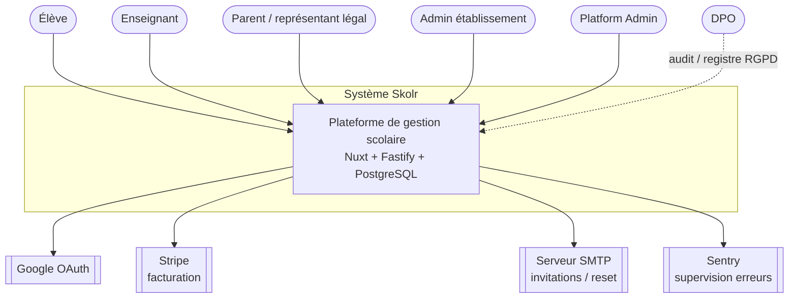
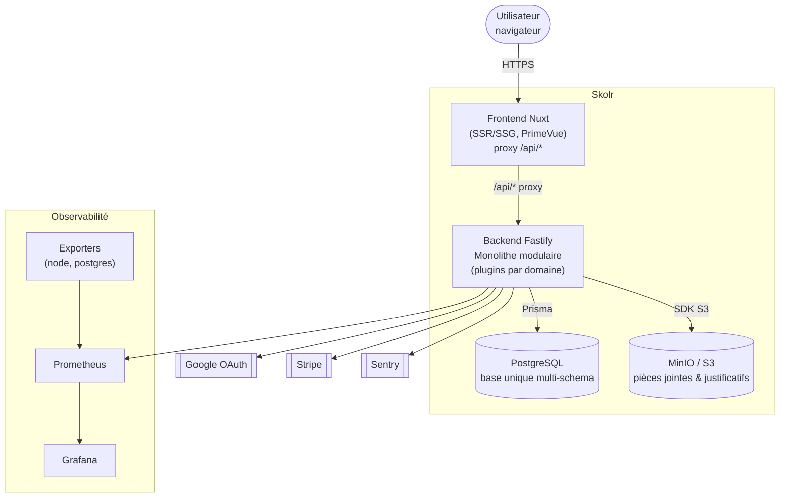
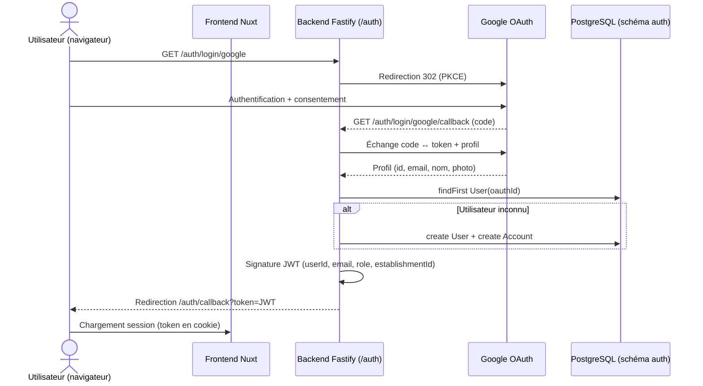
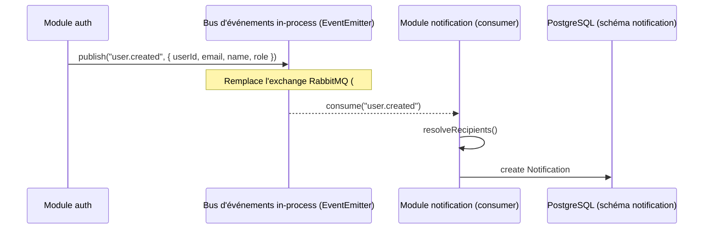

# Architecture Skolr — documentation technique (soutenance RNCP)

> Support de l'histoire d'architecture du projet : le passage de **8 microservices + API Gateway + RabbitMQ** à un **monolithe modulaire** (#114), sur une **base PostgreSQL unique multi-schema**.
>
> Les diagrammes sont fournis en **Mermaid** : les coller dans <https://mermaid.live> pour obtenir une image PNG/SVG à insérer dans Google Docs / Slides.

---

## 1. Vue d'ensemble

Skolr est une plateforme de gestion scolaire. L'architecture actuelle est un **monolithe modulaire** :

- un **seul backend Fastify** déployable, où chaque domaine métier est un **plugin Fastify** monté sous son préfixe (`/auth`, `/class`, `/grade`, `/planning`, `/message`, `/notification`, `/billing`, `/parent`) ;
- une **seule base PostgreSQL multi-schema** (un schéma logique par domaine) ;
- la communication inter-domaines se fait par **appels de fonction intra-process** (synchrone) et un **bus d'événements in-process** (`EventEmitter`, asynchrone) ;
- un **frontend Nuxt** séparé (SSR/SSG + PrimeVue) qui dialogue avec le backend via son proxy `/api/*`.

Ce choix a remplacé l'ancien découpage en microservices (voir **ADR-001**) et une base par service (voir **ADR-002**).

---

## 2. Diagramme C4 — Niveau 1 : Contexte

Acteurs et systèmes externes autour de Skolr.

**Acteurs** : élève, enseignant, parent, admin d'établissement, platform admin, DPO (conformité RGPD).
**Systèmes externes** : Google (OAuth optionnel), Stripe (abonnements), SMTP (invitations / réinitialisation), Sentry (supervision).

---

## 3. Diagramme C4 — Niveau 2 : Conteneurs

**Conteneurs** : Frontend Nuxt · Backend Fastify (monolithe modulaire) · PostgreSQL multi-schema · MinIO (stockage objet des pièces jointes) · stack d'observabilité (Prometheus + Grafana + exporters) · Sentry.

### Modules du backend (plugins Fastify)

| Module | Préfixe | Responsabilité | Schéma DB |
|--------|---------|----------------|-----------|
| `auth` | `/auth` | Authentification, OAuth, JWT, RBAC, invitations, reset | `auth` |
| `class` | `/class` | Classes, élèves, enseignants, cours | `class` |
| `grade` | `/grade` | Notes, devoirs, évaluations, matières | `grade` |
| `planning` | `/planning` | Emplois du temps, absences, justificatifs | `planning` |
| `message` | `/message` | Conversations, messagerie, pièces jointes | `message` |
| `notification` | `/notification` | Notifications (consommateurs d'événements) | `notification` |
| `parent` | `/parent` | Liaison parent ↔ élève | `parent` |
| `billing` | `/billing` | Établissements, abonnements Stripe | `billing` |

---

## 4. Diagramme de séquence — Connexion Google OAuth + propagation d'événement

### 4.1 Connexion OAuth Google

### 4.2 Propagation via le bus d'événements in-process (`user.created` → notification)

> Le bus in-process reprend les **mêmes clés de routage** que l'ancien exchange RabbitMQ (`user.created`, `grade.created`, `absence.*`, `message.received`, `student.enrolled`, `billing.*`). Il est *best-effort* (pas de persistance ni de garantie de livraison) : il n'est **pas** utilisé comme source de vérité (ex. l'anonymisation RGPD passe par des écritures transactionnelles synchrones, pas par un événement).

---

## 5. ADR-001 — De 8 microservices + API Gateway + RabbitMQ vers un monolithe modulaire

- **Statut** : Accepté (#114)
- **Date** : cf. historique Git du refacto #114

### Contexte

La première version découpait le système en **8 microservices** (auth, class, grade, planning, message, notification, parent, billing) derrière une **API Gateway**, communiquant par **HTTP** (synchrone) et un **exchange RabbitMQ** (asynchrone), chaque service possédant **sa propre base**. Sur un projet **développé en solo**, cette architecture générait un coût disproportionné :

- surcharge d'exploitation (8 déploiements, 8 bases, un broker, un gateway) ;
- complexité de développement local et de débogage (traçage inter-services) ;
- cohérence des données difficile (transactions distribuées, duplications) ;
- aucun besoin réel de **scalabilité indépendante** par service à ce stade.

### Options envisagées

1. **Conserver les microservices** — flexibilité maximale, mais coût opérationnel et cognitif injustifié pour un mono-développeur.
2. **Fonctions serverless** — élasticité, mais démarrage à froid, complexité d'orchestration et couplage fournisseur.
3. **Monolithe modulaire** — un seul déployable, modules à frontières explicites, possibilité d'extraire un module en service plus tard si besoin.

### Décision

Adopter un **monolithe modulaire Fastify**. Chaque domaine reste un **plugin Fastify** monté sous **son préfixe historique** (`/auth`, `/class`, …), ce qui **préserve le contrat d'API** : le frontend est inchangé. L'API Gateway est **absorbée** (les préfixes deviennent les points de montage). Les appels HTTP inter-services deviennent des **appels de fonction intra-process** (via des `lib/*ServiceClient.ts` aux signatures conservées) et l'exchange RabbitMQ devient un **bus d'événements in-process** (`EventEmitter`) aux mêmes clés de routage.

### Conséquences

**Positives**
- Exploitation simplifiée : un seul build, un seul déploiement, une seule base.
- Développement/débogage locaux beaucoup plus simples.
- **Transactions ACID inter-domaines possibles** dans un seul processus (ex. l'anonymisation RGPD écrit dans `auth`, `grade` et `billing` dans une même transaction — voir la feature #145).
- Suppression de la latence réseau et du broker.

**Négatives / points de vigilance**
- Perte de la **scalabilité indépendante** par service (mitigation : réplication horizontale du monolithe, réplicas de lecture Postgres, extraction ultérieure d'un module si un vrai besoin apparaît).
- Les **frontières de modules** ne sont plus imposées par le réseau : elles reposent sur une **convention** (dossiers `modules/<domaine>`, communication uniquement via `service.ts` et le bus) — à faire respecter en revue.
- Le bus in-process est *best-effort* (pas de persistance) : ne pas s'en servir pour des flux critiques nécessitant une garantie de livraison.

---

## 6. ADR-002 — Base PostgreSQL unique multi-schema (vs une base par service)

- **Statut** : Accepté (#114)

### Contexte

Le découpage microservices imposait **une base par service**, d'où duplication de données de référence (ex. copies d'utilisateurs) et cohérence inter-bases coûteuse. Le passage au monolithe (ADR-001) permet de repenser la persistance.

### Options envisagées

1. **Une base par domaine** (statu quo) — isolation forte, mais pas de requêtes/transactions transverses et forte duplication.
2. **Une base, un seul schéma `public`** — simple, mais perte de la lisibilité des frontières de domaine.
3. **Une base, multi-schema** — un schéma logique par domaine (`auth`, `class`, `grade`, …), frontières explicites tout en autorisant le transverse.

### Décision

Adopter **une base PostgreSQL unique en multi-schema**, déclarée dans un `schema.prisma` consolidé (`schemas = ["auth","class","grade","planning","message","notification","billing","parent"]`). Les copies locales historiques (ex. `User`/`Class`/`Course` du domaine grade) sont **conservées mais renommées** (`GradeUser`/`GradeClass`/`GradeCourse`) pour éviter les collisions de noms au sein du client Prisma unique.

### Conséquences

**Positives**
- **Requêtes et transactions transverses** possibles via un unique client Prisma (fondation directe de l'export et de l'effacement RGPD, qui parcourent tous les schémas).
- Frontières de domaine **restées lisibles** (un schéma = un domaine).
- Une seule migration, un seul point de sauvegarde.

**Négatives / points de vigilance**
- **Aucune clé étrangère cross-schema** vers `auth.User` : les références (`userId`, `teacherId`, …) sont des `String` nus. L'intégrité référentielle transverse repose donc sur la **logique applicative** (ex. l'anonymisation RGPD doit traiter explicitement chaque schéma).
- **Duplication d'identité** persistante (`grade.GradeUser` porte nom + email) : à gérer aux points sensibles (export, effacement) — la clé de jointure transverse est l'**email**.
- Isolation moindre qu'avec des bases séparées (acceptable au vu du périmètre et des bénéfices).

---

*Document destiné à la soutenance RNCP 39583. Diagrammes à exporter depuis mermaid.live pour insertion dans le support.*
