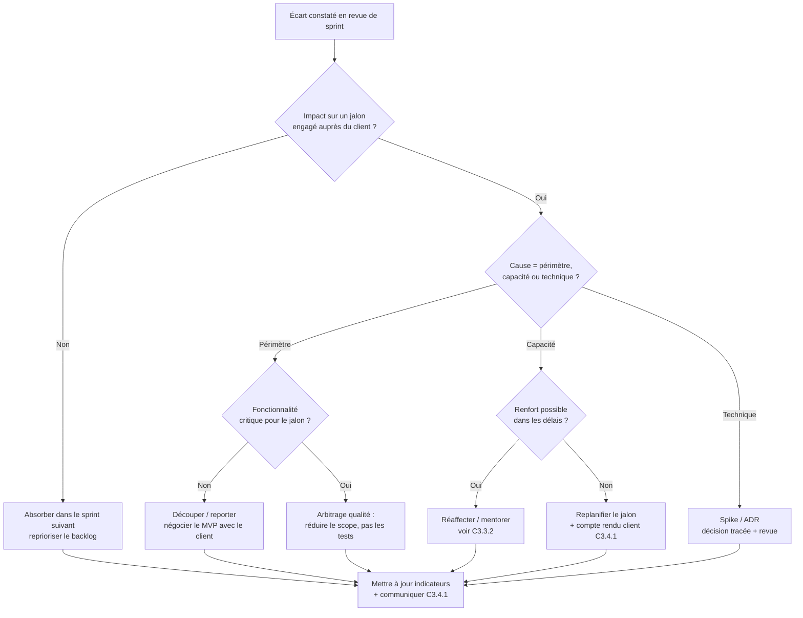

# Bloc 3 — Coordonner et piloter un projet de développement

> Support de soutenance RNCP 39583, **Bloc 3 : « Coordonner et piloter un projet de développement
> d'applications logicielles »**. Ce document couvre les six compétences du bloc (C3.2.1 → C3.4.2).
> Complément de `docs/soutenance/soutenance.md` (trame de slides, démo, Q&A Bloc 2).

---

## 0. Cadrage — ce qui est réel, ce qui est une mise en situation

Skolr a été **réalisé en solo** sur plusieurs mois. Le Bloc 3 évalue le **pilotage de projet et le
management d'équipe** : une partie s'appuie donc sur des **artefacts réels** du dépôt, l'autre sur une
**mise en situation assumée**. La distinction est faite explicitement, compétence par compétence, pour
rester honnête devant le jury.

| Compétence | Nature de la preuve |
|---|---|
| **C3.2.1** Piloter l'avancement | **Réel** — GitHub Issues, PR liées, releases, CI |
| **C3.2.2** Arbitrages & logigramme | **Réel** (ADR-001/002) + logigramme de décision |
| **C3.3.1** Piloter l'équipe | **Mise en situation** (projet solo → scénario d'équipe) |
| **C3.3.2** Besoins en compétences | **Mise en situation** |
| **C3.4.1** Comptes rendus client | **Réel** (CHANGELOG, releases) + dispositif proposé |
| **C3.4.2** Démonstration | **Réel** — captures + vidéos de walkthrough, script de démo |

> ⚠️ **Mise en situation (C3.3).** Le projet n'ayant pas mobilisé d'équipe, les sections C3.3.1 et
> C3.3.2 décrivent **comment je piloterais et ferais monter en compétences une équipe** sur ce même
> projet. Rien dans ce document ne prétend qu'une équipe a réellement existé.

### Équipe fictive de référence (pour C3.3)

Scénario réaliste pour une V2 de Skolr passant en phase de croissance :

| Rôle | Périmètre | Séniorité |
|---|---|---|
| **Moi — Lead / Tech Lead** | Architecture, revues, arbitrages, relation commanditaire | Senior |
| **Dev Backend** | Modules `grade`, `planning`, `billing` (Fastify/Prisma) | Confirmé |
| **Dev Frontend** | Nuxt / PrimeVue, accessibilité, i18n | Confirmé |
| **QA / Testeur** | Playwright e2e, cahier de recettes, non-régression | Junior |
| **Designer UX/UI (mi-temps)** | Maquettes, design system, accessibilité RGAA | Confirmé |
| **Alternant Dev** | Modules `message`, `notification` sous mentorat | Débutant |

Cadre projet : itérations de **2 semaines**, **jalons** trimestriels alignés sur les besoins
établissement (rentrée, conseils de classe, bulletins), triangle **délais / qualité / coûts** suivi
à chaque revue de sprint.

---

## C3.2.1 — Piloter l'avancement du projet

**Outils de suivi (réels, en place sur le dépôt) :**

- **GitHub Issues** comme unique backlog (96 issues à ce jour), avec une **taxonomie de labels**
  structurée et déjà utilisée :
  - `type:` feature / bug / doc / tech
  - `service:` auth / class / grade / planning / message / notification / frontend / gateway
  - `priority:` critical / high / medium / low
  - `status:` blocked / in-progress / ready-to-review
- **Une PR par issue**, systématiquement liée (`closes #`), garantissant la traçabilité
  besoin → code → livraison.
- **Gate de process** : le workflow `pr-validation.yml` **refuse toute PR** qui ne référence pas une
  issue et ne documente pas une section de test — un contrôle d'avancement automatisé.
- **Releases versionnées** (`v1.0.0`, `v1.0.1`) suivant le **Semantic Versioning**, jalonnant les
  livraisons stables.
- **Board GitHub Projects** *SKOLR Project* (98 items, lié au dépôt) : pipeline de statut en 5 étapes
  (`Backlog → In progress → In review → Ready → Done`, **87 terminés**) et champs de pilotage
  **Priority** (P0/P1/P2), **Size**, **Estimate**, **Start date**, **Target date**. Plusieurs **Vues**
  filtrées du *même* board (avancement par statut, roadmap, dette technique, features,
  quality-of-life/DX, grooming) donnent chacune un angle de suivi sans fragmenter les données — plus
  un board *SKOLR Roadmap 2026* pour la vue calendaire.
- **Jalons (milestones)** en 4 paliers — `Fondations (v0.x)`, `v1.0.0 — MVP`,
  `v1.0.1 — Conformité RNCP / sécurité` (adossés aux **tags réels**), `v1.1 — Post-RNCP` — offrant un
  **burn-up par jalon** (15 / 63 / 7 issues livrées, 8 planifiées).
- **Décomposition en epics (sous-issues natives)** : les gros chantiers du backlog sont structurés en
  issue parente + sous-issues, avec barre de progression `Sub-issues progress` sur le board — p. ex.
  `#168 Dette technique & DX` (8 sous-tâches : Docker, CodeQL, Dependabot, backup PostgreSQL, template
  de PR…) et `#139 i18n` (→ `#78`). Hiérarchie besoin → chantier → tâche.

**Indicateurs de pilotage (triangle délais / qualité / coûts) :**

| Dimension | Indicateur | Source |
|---|---|---|
| Délais | Issues clôturées par jalon (burn-up) | Milestones + champ *Target date* du board |
| Qualité | Taux de PR vertes en CI, **couverture de tests** (82,9 % back) | GitHub Actions, `strategy.md` |
| Qualité | Nombre d'anomalies rouvertes après livraison | Labels `type: bug` + historique |
| Coûts | Charge consommée vs planifiée par palier | Champs *Estimate* / *Size* du board |

**Communication sur les indicateurs :** revue de sprint bi-hebdomadaire, tableau de bord d'avancement
(issues ouvertes/fermées, burndown), et point de synthèse à chaque jalon trimestriel.

> Note d'honnêteté : le board Projects et les 4 jalons **existent et sont renseignés**, mais leur
> **consolidation est en partie rétrospective** (regroupement des issues livrées par palier a
> posteriori, pas un rituel de mise à jour au jour le jour). La marge de progrès restante tient à la
> **discipline de remplissage** des champs de charge (*Estimate*, *Target date*), pas à l'outillage.

---

## C3.2.2 — Procéder aux arbitrages (analyse des écarts et dérives)

**Arbitrages réels documentés** — les décisions structurantes du projet sont tracées en **ADR**
(Architecture Decision Records), format constat → décision → conséquences :

- **ADR-001** — abandon d'un découpage en 8 microservices + API Gateway + RabbitMQ au profit d'un
  **monolithe modulaire** : arbitrage coût d'exploitation vs bénéfice de scalabilité, tranché en
  faveur de la maîtrise sur un projet à faible effectif. Voir `docs/architecture/architecture.md` §5.
- **ADR-002** — **base PostgreSQL unique multi-schéma** vs une base par service : arbitrage sur la
  duplication de données de référence et le coût de cohérence inter-bases. Voir §6.

**Outil d'aide à la décision — logigramme d'arbitrage face à une dérive.** Processus systématique
appliqué dès qu'un écart (délai, périmètre, qualité) est constaté en revue de sprint :

Ce logigramme relie explicitement l'arbitrage aux autres compétences : un renfort renvoie à la
gestion des compétences (**C3.3.2**), un replanning déclenche un **compte rendu client** (**C3.4.1**).

---

## C3.3.1 — Piloter l'équipe *(mise en situation)*

> Scénario : pilotage de l'équipe fictive définie au §0 pour une V2 de Skolr.

**Affectation des missions** — par **domaine métier**, en s'appuyant sur les frontières déjà nettes du
monolithe modulaire (un plugin Fastify par module) :

- Backend confirmé → `grade` / `billing` (logique métier sensible : notes, paiements).
- Frontend confirmé → refonte accessible du design system, i18n.
- Alternant → `message` / `notification` (périmètre cadré, à faible risque) **sous mentorat**.
- QA junior → cahier de recettes et suite e2e Playwright, en binôme montant.

**Prise en compte des personnes en situation de handicap :**

- Côté **équipe** : aménagement des postes (matériel adapté, télétravail, outils compatibles lecteurs
  d'écran), rituels asynchrones documentés pour ne pas pénaliser selon le rythme ou le canal.
- Côté **produit** : l'exigence d'accessibilité est déjà un axe du projet (**RGAA 4.1**, 9 actions
  livrées, plugin ESLint d'accessibilité en CI — voir `docs/security/accessibility.md`). Elle devient
  un **critère de définition de « terminé »** partagé par toute l'équipe, pas une tâche isolée.

**Contexte multiculturel / international :**

- Équipe potentiellement **distribuée** (fuseaux horaires) → cœur d'heures communes réduit,
  communication majoritairement **asynchrone et écrite** (issues, PR, ADR font foi).
- **Langue de travail** explicite (français pour le métier scolaire FR, anglais pour le code et la
  doc technique) — cohérent avec le produit **entièrement internationalisé** (i18n fr, extension en
  cohérence, voir issues #139/#78).
- Sensibilité aux **jours fériés et calendriers** différents dans la planification des jalons.

**Techniques de communication et managériales :**

- Rituels agiles : **daily** (async si distribué), **revue de sprint**, **rétrospective**, **1:1**
  réguliers pour le suivi individuel.
- **Revue de code** comme vecteur de communication technique et de montée en compétences (déjà la
  norme sur le dépôt : 1 PR = 1 revue).
- Décisions structurantes tracées en **ADR** → mémoire d'équipe, onboarding facilité.

**Respect du plan établi :** suivi des jalons trimestriels, réajustement via le logigramme C3.2.2,
transparence sur les écarts en revue.

---

## C3.3.2 — Évaluer les besoins en compétences *(mise en situation)*

**Matrice de compétences** de l'équipe (base d'évaluation) :

| Compétence | Lead | Back | Front | QA | Alternant |
|---|:---:|:---:|:---:|:---:|:---:|
| Fastify / Prisma | ●●● | ●●● | ● | ○ | ● |
| Nuxt / PrimeVue | ●● | ● | ●●● | ● | ●● |
| Tests e2e Playwright | ●● | ●● | ●● | ●● | ○ |
| Sécurité / RGPD | ●●● | ●● | ● | ● | ○ |
| Accessibilité RGAA | ●● | ● | ●●● | ● | ○ |

*(●●● maîtrise · ●● autonome · ● notions · ○ à former)*

**Besoins de recrutement transmis au service RH :**

- Un profil **DevOps/SRE** — la chaîne CI/CD, Docker, monitoring (Prometheus/Grafana/Sentry) repose
  aujourd'hui sur une seule personne : **point de fragilité** identifié pour la mise à l'échelle.
- À terme, un second **Frontend** si le rythme de features UI s'accélère.

**Plan de développement des compétences :**

- Alternant → parcours **Fastify/Prisma** encadré (pairing + revues ciblées) pour gagner en autonomie
  sur les modules qui lui sont confiés.
- QA junior → montée sur la **stratégie de test** (pyramide back/front/e2e documentée dans
  `docs/tests/strategy.md`) et l'automatisation.

**Orientation vers des formations adaptées :**

- **Accessibilité** (RGAA / WCAG) pour le pôle front — le projet en fait déjà un critère qualité.
- **Sécurité applicative** (OWASP Top 10, déjà cartographié dans `docs/security/audit.md`) pour
  l'ensemble de l'équipe backend.

---

## C3.4.1 — Effectuer des comptes rendus d'activité au client

**Dispositif réel en place :**

- **CHANGELOG.md** au format **Keep a Changelog** — chaque évolution notable est consignée
  (Added / Changed / Fixed), lisible par une audience non technique.
- **Notes de release** versionnées (`v1.0.0`, `v1.0.1`) présentant les évolutions livrées.

**Points de validation planifiés :** revue de fin de jalon avec le commanditaire (établissement),
présentant les évolutions depuis le jalon précédent et actant la validation avant de poursuivre.

**Indicateurs de satisfaction proposés :**

- **Objectif d'adoption** déjà cadré dans la problématique (slide 2 de `soutenance.md`) : réduction
  de **−50 % des tâches administratives**.
- Enquête d'adoption / satisfaction auprès des rôles (admin, enseignant, parent) après chaque jalon,
  suivie dans le temps pour mesurer l'adhésion réelle.

---

## C3.4.2 — Réaliser une démonstration des fonctionnalités

**Supports réels de démonstration** (dernière version logicielle) :

- **3 vidéos de walkthrough** (`packages/e2e/demo/*.webm`) : parcours statistiques, planning
  enseignant/admin — captures issues de la suite e2e, donc **fidèles au produit réel**.
- **15 captures d'écran** versionnées (`packages/e2e/demo/*.png`) documentant les écrans clés par PR.
- **Script de démo pas-à-pas** avec base déterministe et comptes seedés : `soutenance.md` §3.

**Vocabulaire adapté à l'audience :** la démo commanditaire (direction d'établissement, non technique)
est structurée **par rôle et par usage** (« l'enseignant saisit ses notes », « le parent suit les
absences ») plutôt que par brique technique — la validation porte sur la **valeur métier**, pas sur
l'implémentation.

---

## Récapitulatif — couverture du Bloc 3

| Compétence | Preuve | Nature |
|---|---|---|
| **C3.2.1** Piloter l'avancement | Issues + labels + PR liées + releases + CI | ✅ Réel |
| **C3.2.2** Arbitrages & logigramme | ADR-001/002 + logigramme de décision | ✅ Réel |
| **C3.3.1** Piloter l'équipe | Affectation, handicap, international, rituels | 🎭 Mise en situation |
| **C3.3.2** Besoins en compétences | Matrice, recrutement RH, formations | 🎭 Mise en situation |
| **C3.4.1** Comptes rendus client | CHANGELOG + releases + indicateurs | ✅ Réel + dispositif |
| **C3.4.2** Démonstration | Vidéos + captures + script de démo | ✅ Réel |

*Document destiné à la préparation de la soutenance RNCP 39583 — Bloc 3.*
